# goit-rdb-hw-04

DML та DDL команди. Складні SQL вирази:

### Завдання 1:

> Створіть базу даних для керування бібліотекою книг згідно зі структурою, наведеною нижче. Використовуйте DDL-команди для створення необхідних таблиць та їх зв'язків.

---

```sql
CREATE DATABASE LibraryManagement;
```

_p1_create_schema.png_
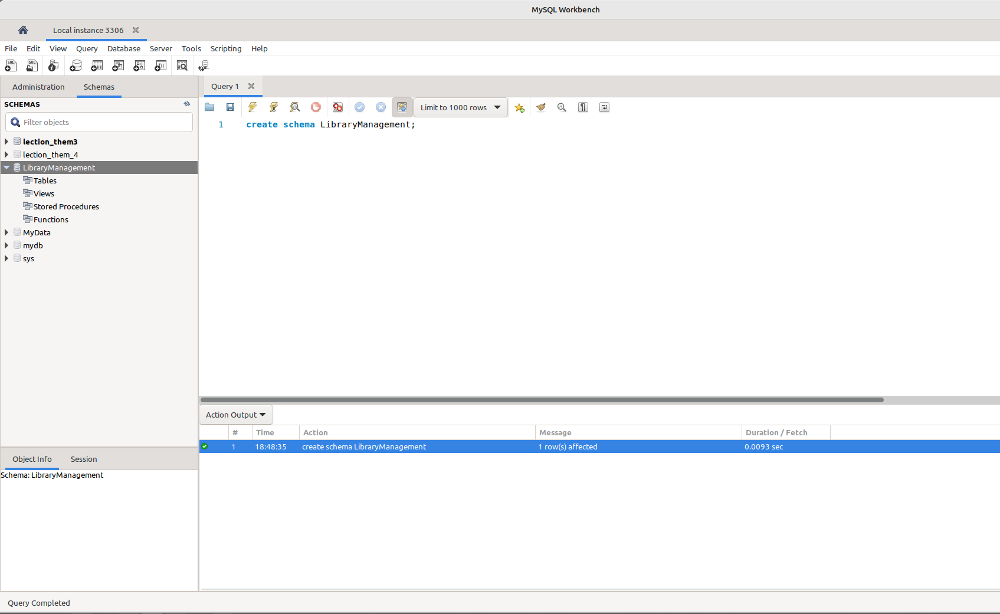

---

```sql
CREATE TABLE authors (
    author_id INT AUTO_INCREMENT PRIMARY KEY,
    author_name VARCHAR(255)
);
CREATE TABLE genres (
    genre_id INT AUTO_INCREMENT PRIMARY KEY,
    genre_name VARCHAR(255)
);
CREATE TABLE books (
    book_id INT AUTO_INCREMENT PRIMARY KEY,
    title VARCHAR(255),
    publication_year YEAR,
    author_id INT,
    genre_id INT,
    FOREIGN KEY (author_id) REFERENCES authors (author_id),
    FOREIGN KEY (genre_id) REFERENCES genres (genre_id)
);
CREATE TABLE users (
    user_id INT AUTO_INCREMENT PRIMARY KEY,
    username VARCHAR(255),
    email VARCHAR(255)
);
CREATE TABLE borrowed_books (
    borrow_id INT AUTO_INCREMENT PRIMARY KEY,
    book_id INT,
    user_id INT,
    borrow_date DATE,
    return_date DATE,
    FOREIGN KEY (book_id) REFERENCES books (book_id),
    FOREIGN KEY (user_id) REFERENCES users (user_id)
);
```

_p1_create_tables.png_
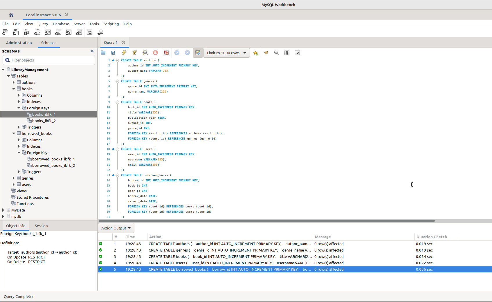

---

### Завдання 2:

> Заповніть таблиці простими видуманими тестовими даними. Достатньо одного-двох рядків у кожну таблицю.

---

```sql
INSERT INTO authors (author_name) VALUES
('Тарас Шевченко'),
('Ліна Костенко'),
('Іван Франко');

INSERT INTO genres (genre_name) VALUES
('Поезія'),
('Проза'),
('Історичний роман');

INSERT INTO books (title, publication_year, author_id, genre_id) VALUES
('Кобзар', 1950, 1, 1),
('Маруся Чурай', 1979, 2, 3),
('Захар Беркут', 1983, 3, 2);

INSERT INTO users (username, email) VALUES
('ivan123', 'ivan@example.com'),
('olena456', 'olena@example.com'),
('petro789', 'petro@example.com');

INSERT INTO borrowed_books (book_id, user_id, borrow_date, return_date) VALUES
(1, 1, '2025-05-01', '2025-05-10'),
(2, 2, '2025-05-03', '2025-05-12'),
(3, 3, '2025-05-05', NULL);
```

_p2_adding_data.png_
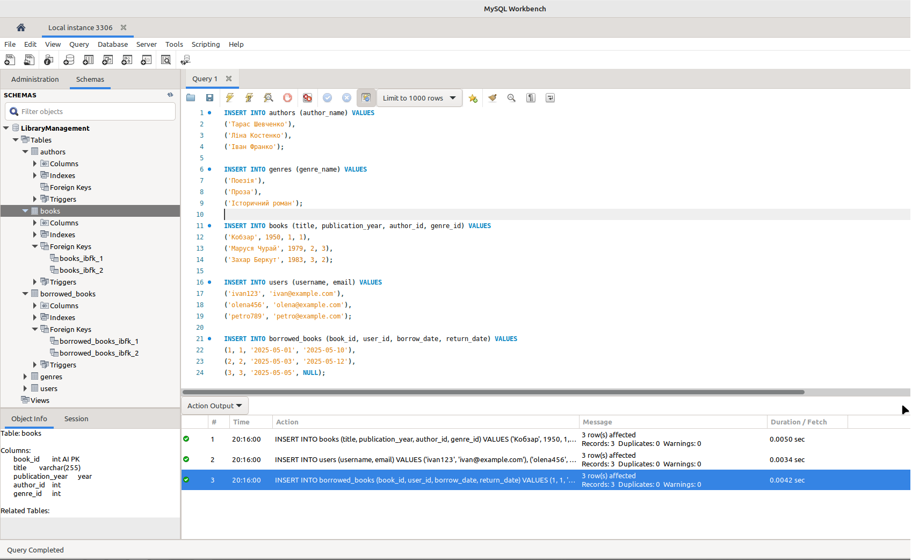

---

### Завдання 3:

> Перейдіть до бази даних, з якою працювали у темі 3. Напишіть запит за допомогою операторів FROM та INNER JOIN, що об'єднує всі таблиці даних, які ми завантажили з файлів: order_details, orders, customers, products, categories, employees, shippers, suppliers. Для цього ви маєте знайти спільні ключі.
>
> Перевірте правильність виконання запиту.

---

```sql
SELECT *
FROM order_details
INNER JOIN orders ON order_details.order_id = orders.id
INNER JOIN customers ON orders.customer_id = customers.id
INNER JOIN employees ON orders.employee_id = employees.employee_id
INNER JOIN shippers ON orders.shipper_id = shippers.id
INNER JOIN products ON order_details.product_id = products.id
INNER JOIN categories ON products.category_id = categories.id
INNER JOIN suppliers ON products.supplier_id = suppliers.id;
```

**Results:** [p3.csv](./p3.csv)

_p3_join.png_
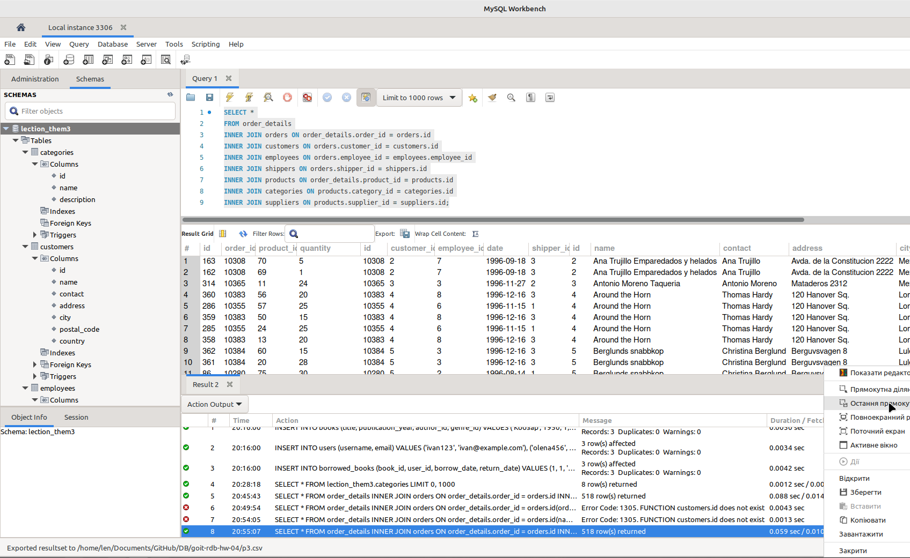

---

### Завдання 4:

> Виконайте запити, перелічені нижче.
>
> - Визначте, скільки рядків ви отримали (за допомогою оператора COUNT).
> - Змініть декілька операторів INNER на LEFT чи RIGHT. Визначте, що відбувається з кількістю рядків. Чому? Напишіть відповідь у текстовому файлі.
> - На основі запита з пункта 3 виконайте наступне: оберіть тільки ті рядки, де employee_id > 3 та ≤ 10.
> - Згрупуйте за іменем категорії, порахуйте кількість рядків у групі, середню кількість товару (кількість товару знаходиться в order_details.quantity)
> - Відфільтруйте рядки, де середня кількість товару більша за 21.
> - Відсортуйте рядки за спаданням кількості рядків.
> - Виведіть на екран (оберіть) чотири рядки з пропущеним першим рядком.

---

#### 1. Кількість рядків

```sql
SELECT COUNT(*) AS total_rows
FROM order_details
INNER JOIN orders ON order_details.order_id = orders.id
INNER JOIN customers ON orders.customer_id = customers.id
INNER JOIN employees ON orders.employee_id = employees.employee_id
INNER JOIN shippers ON orders.shipper_id = shippers.id
INNER JOIN products ON order_details.product_id = products.id
INNER JOIN categories ON products.category_id = categories.id
INNER JOIN suppliers ON products.supplier_id = suppliers.id;
```

_p4_count.png_
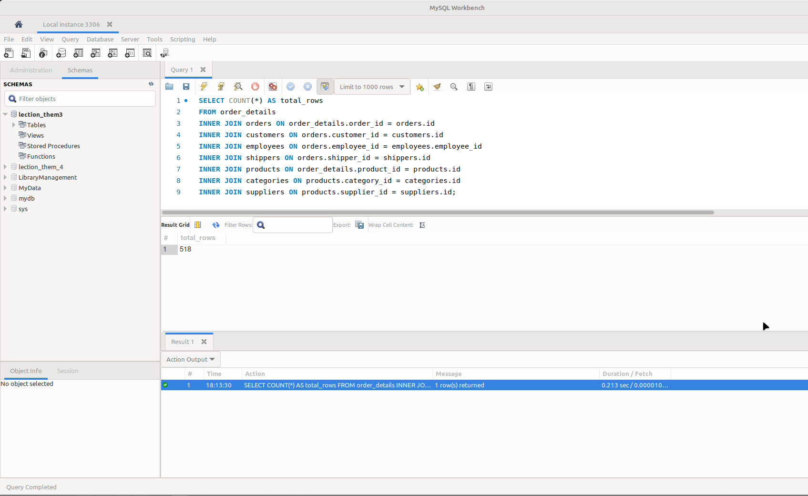

---

#### 2. Заміна JOIN

```sql
SELECT COUNT(*) AS row_count
FROM order_details
LEFT JOIN orders ON order_details.order_id = orders.id
LEFT JOIN customers ON orders.customer_id = customers.id
LEFT JOIN employees ON orders.employee_id = employees.employee_id
LEFT JOIN shippers ON orders.shipper_id = shippers.id
RIGHT JOIN products ON order_details.product_id = products.id
RIGHT JOIN categories ON products.category_id = categories.id
INNER JOIN suppliers ON products.supplier_id = suppliers.id;
```

В результаті підрахунку з'явився додатковий рядок який містить невідповідні данні. Рядок був доданий в таблицю "order_details".

_p4_change_join.png_
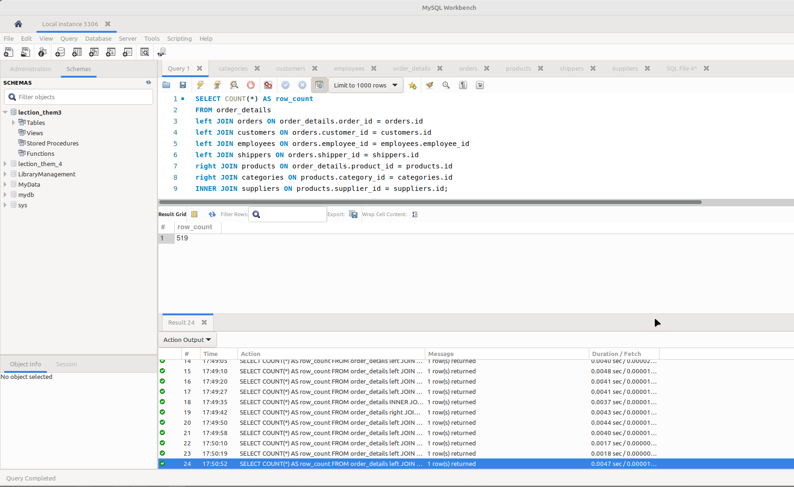

---

#### 3. Фільтрація employee_id

```sql
SELECT *
FROM order_details
INNER JOIN orders ON order_details.order_id = orders.id
INNER JOIN customers ON orders.customer_id = customers.id
INNER JOIN employees ON orders.employee_id = employees.employee_id
INNER JOIN shippers ON orders.shipper_id = shippers.id
INNER JOIN products ON order_details.product_id = products.id
INNER JOIN categories ON products.category_id = categories.id
INNER JOIN suppliers ON products.supplier_id = suppliers.id
WHERE employees.employee_id > 3 AND employees.employee_id <= 10;
```

_p4_filter_employee_id.png_
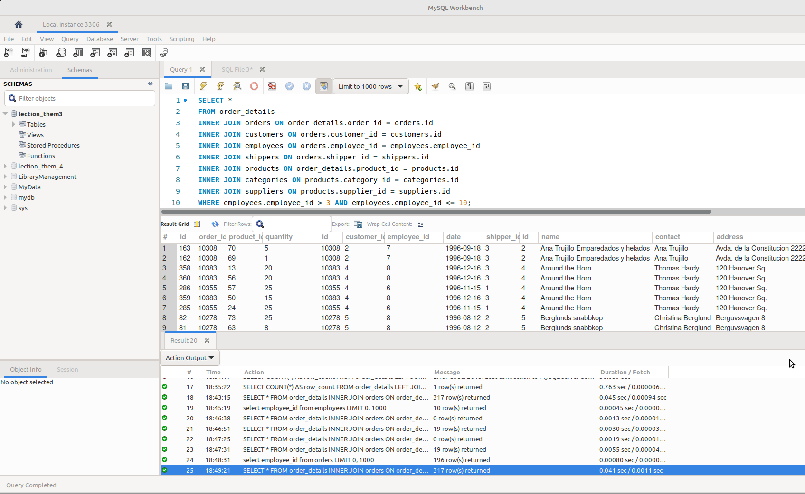

---

#### 4. Групування за іменем категорії

```sql
SELECT categories.name AS category_name,
       COUNT(*) AS row_count,
       AVG(order_details.quantity) AS avg_quantity
FROM order_details
INNER JOIN products ON order_details.product_id = products.id
INNER JOIN categories ON products.category_id = categories.id
GROUP BY categories.name;
```

_p4_group_by_category.png_
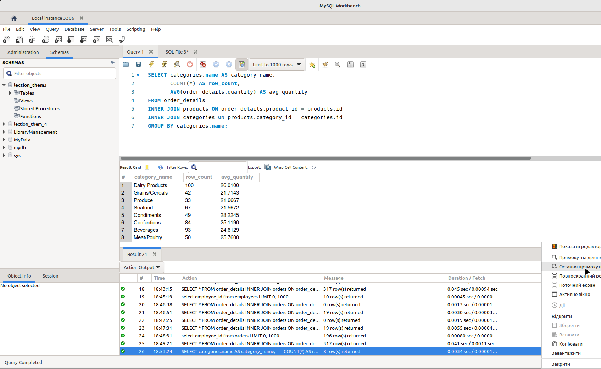

---

#### 5. Фільтрація avg_quantity

```sql
SELECT categories.name AS category_name,
       COUNT(*) AS row_count,
       AVG(order_details.quantity) AS avg_quantity
FROM order_details
INNER JOIN products ON order_details.product_id = products.id
INNER JOIN categories ON products.category_id = categories.id
GROUP BY categories.name
HAVING AVG(order_details.quantity) > 21;
```

_p4_filter_avg_quantity_21.png_
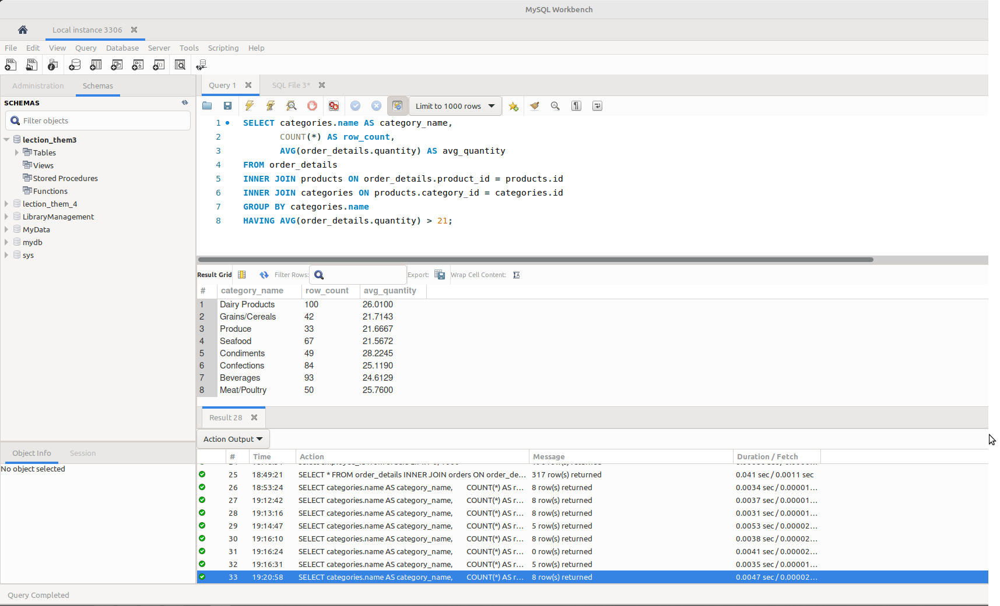

З значенням "21" фільтрація не відпрацьовує коректно, тому створив додатковий запит зі значенням "22".

_p4_filter_avg_quantity_22.png_
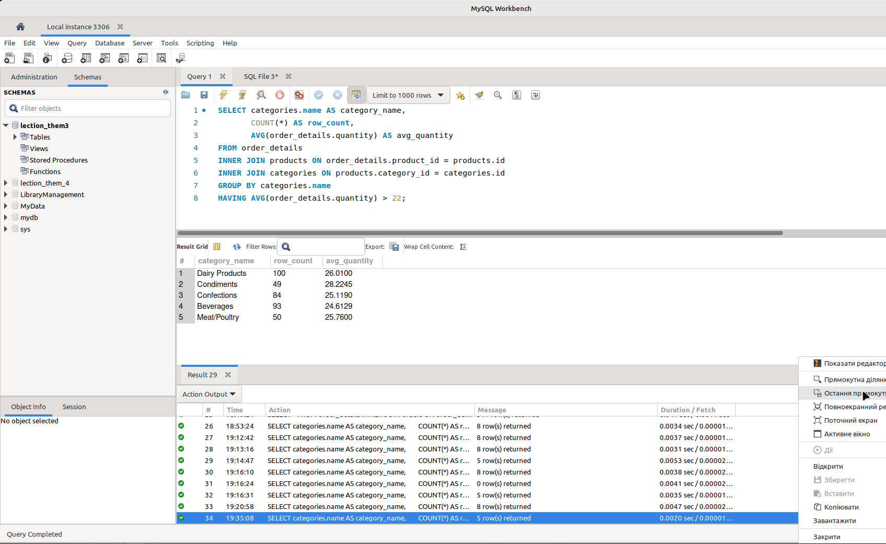

---

#### 6. Сортування за спаданням кількості рядків

```sql
SELECT categories.name AS category_name,
       COUNT(*) AS row_count,
       AVG(order_details.quantity) AS avg_quantity
FROM order_details
INNER JOIN products ON order_details.product_id = products.id
INNER JOIN categories ON products.category_id = categories.id
GROUP BY categories.name
HAVING AVG(order_details.quantity) > 21
ORDER BY row_count DESC;
```

_p4_ordered.png_
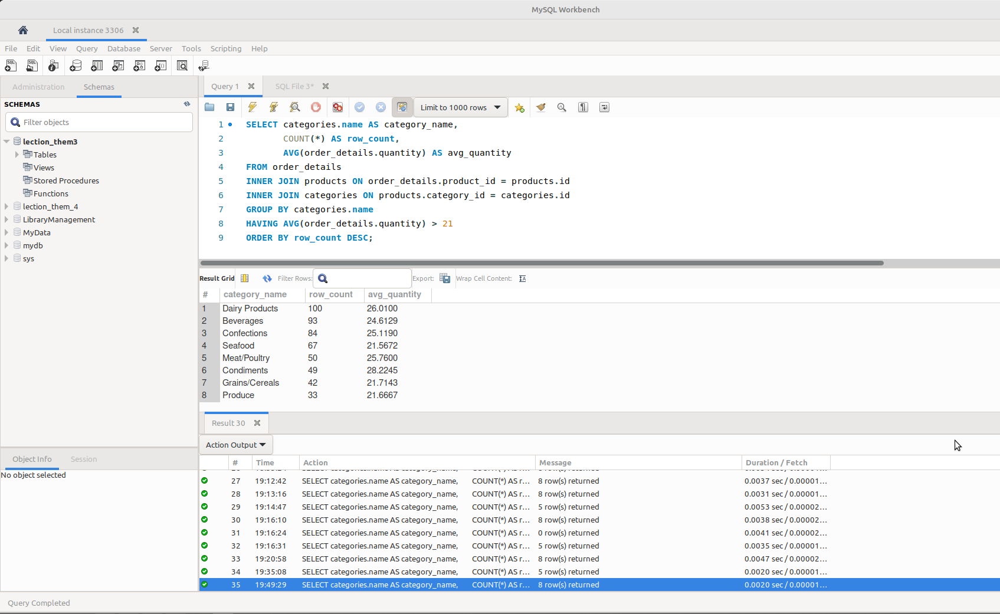

---

#### 7. OFFSET

```sql
SELECT categories.name AS category_name,
       COUNT(*) AS row_count,
       AVG(order_details.quantity) AS avg_quantity
FROM order_details
INNER JOIN products ON order_details.product_id = products.id
INNER JOIN categories ON products.category_id = categories.id
GROUP BY categories.name
HAVING AVG(order_details.quantity) > 21
ORDER BY row_count DESC
LIMIT 4 OFFSET 1;
```

_p4_offset.png_
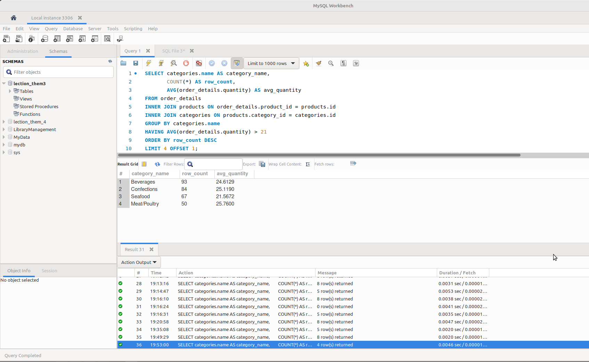

---
